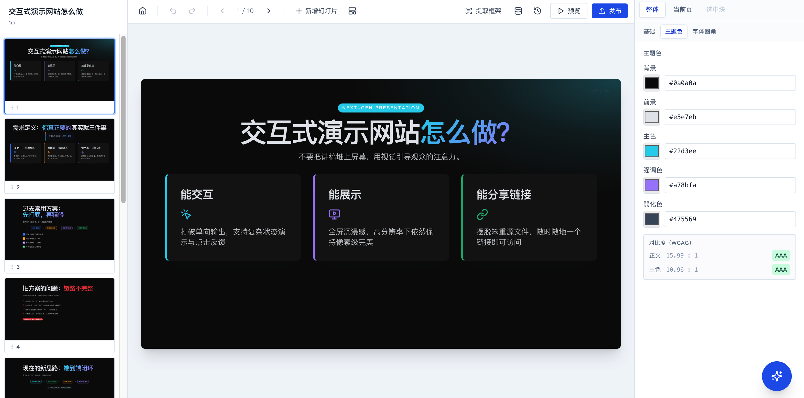

# Huaxushuo

English · [简体中文](./README.md)

**Huaxushuo** turns your line of thought into a visible, intuitive demo — an interactive website. It doesn't chase elaborate visuals; it stays simple and direct so the deck becomes the cue card for your talk, **letting you focus on what you're actually saying** instead of getting stuck producing slides or images. The path from *idea → talk* becomes more graceful.

```bash
# One-line scaffold (recommended)
npx @huaxushuo/cli init huaxushuo
cd huaxushuo && pnpm dev
```



## Why Huaxushuo

Existing tools either ship pure static decks (Gamma / Tome — no interactivity) or emit raw React (v0 / bolt.new — no structure, hard to control).

Huaxushuo takes a third path: **LLM emits DSL, runtime renders deterministically**.

> Goal: natural language → presentable content in minutes (10 slides in 30 seconds, 20–30 slides in 5–10 minutes).

- vs PPT — clickable, animated, supports variable state, one-click publish to a public URL
- vs Mind maps — progressive linear reasoning closer to how you actually speak; no zoom-in/out or expand/collapse gymnastics when branches multiply
- vs Gamma / Tome — leans toward "interactive product prototypes," not pure static decks
- vs Figma — no design skills required; driven by natural language
- vs v0 / bolt.new — structured DSL output: controllable, editable, stable

## Highlights

Every slide renders into a `1280×720` (or `1024×768` / vertical auto) canvas. Layouts, blocks, and utilities are strictly defined by Zod schemas and filtered against a whitelist at runtime. The LLM emits deck JSON; a deterministic renderer renders it — preserving the flexibility of conversational generation while avoiding the fragility of "agent writes raw code" tools.

### 🎨 11 layouts × 16 blocks × 30+ utilities

11 layouts (`hero` / `title-content` / `two-column` / `three-column` / `four-column` / `five-column` / `bullet-list` / `quote` / `cta` / `embed` / `free`); 9 base blocks (text / heading / image / button / list / badge / iframe / icon / card) + 3 advanced (form / modal / tab) + 4 data-decorative (stat / flow / table / chrome). 30+ visual utilities (frost / shadow / backdrop / text gradient / tilt / float) gated by a whitelist. CSS uses `color-mix` to track theme colors.

### 🤖 Multi-model, multi-protocol

Native Anthropic protocol + OpenAI-compatible protocol (one codebase covering 9 presets: OpenAI / Deepseek / Kimi / Zhipu GLM / Alibaba Qwen / SiliconFlow / Google Gemini / Xiaomi MiMo / custom baseURL). Models are slotted by capability (**general / text-only / multimodal**); users customize routing priority, with image-recognition automatically routed to the multimodal slot. The Anthropic system prompt uses `cache_control: ephemeral`; multi-turn editing hits cache > 90%.

### ⚡ Stream-while-render + long-doc batching

A custom `streamParser` scans the partial JSON stream for object boundaries inside the `"slides":[` array. Each completed slide is validated by `SlideSchema` before being committed to the store and rendered — the **first slide typically lands in 1–2 seconds**. Long inputs (≥ 2000 chars + ≥ 3 segment markers) auto-batch into 3-page chunks; a slimmed `contextDeck` (theme + slide skeletons only) cuts continuation input tokens from ~6000 to ~2000. A 10-page deck goes from 10 round-trips to 4 (3+3+3+1), prefill cost −60%. Cancel keeps the partial deck; ⌘Z one step rolls back.

### 🖼️ Imagery (picsum + Pexels)

The LLM autonomously decides when to add imagery (intro / product / concept slides yes; data / flow / numbered-list / closing CTA no), emitting `picsum.photos/seed/{slug}/{w}/{h}` placeholder URLs (always 200 OK, never 404). With a Pexels API key configured, a background job fetches keyword-matched real photos by slug and swaps URLs in place — the user sees the deck instantly, then images upgrade silently. Image-vs-text contrast protection is mandatory: when `image` is used as a `slide.background`, headings must carry `hxs-text-glow` or sit inside a frosted card.

### ✨ Visual Patterns + Skill packs

10 built-in visual patterns (`patternsBuiltin.ts`: dark-glow-hero / stat-grid-3 / mac-window-cover / card-list-bars / numbered-quad-tone / dark-comparison-table / painpoint-vs-solution / flow-3step / bold-quote-glow / dark-cta-glow). A whole slide can write `patternRef:"<id>"` to reuse layout/utilities and override only `blocks` text. 6 built-in skill packs (`skillsBuiltin.ts`) carry triggers + 600–1200-character `systemAddon` recipes + recommended pattern fewshots; matching a trigger auto-injects. A from-screenshot dialog lets users grow the library — pattern + skill in one shot, zero source-code changes.

### 🌐 Full bilingual i18n (zh-CN / en)

UI + system prompts + built-in library names/descriptions (pattern / skill / style) + error messages + progress text + example decks — **all** bilingual. The `BASE_SYSTEM_PROMPT` (DSL doc, ~5K tokens) stays Chinese to save tokens; `CREATIVE_ADDONS` (creative principles + fewshot deck) switches between ZH/EN; an output-language directive is appended at the end. First visit auto-detects via `navigator.language`; user choice persists in `localStorage`.

### 🛡️ Two-layer contrast protection

- **Live in editor**: DeckPanel shows bg↔fg / bg↔primary contrast (WCAG 2.x) with 4-tier badges; < 4.5 surfaces an amber warning + one-click auto-fix
- **Auto-normalize at generation time**: after `DeckSchema.safeParse`, `normalizeThemeContrast` runs — in dark mode, fg vs bg ratio < 3:1 gets replaced with a safe color, preventing "dark-on-dark" disasters from misbehaving LLM output

### 📦 Three publish formats

- **Zip export** — in-browser packaging + one-line deploy commands for Cloudflare Pages / Vercel / Netlify Drop / Surge.sh
- **Cloudflare one-click upload** — self-hosted Worker holds the API token; the browser never sees your CF key. Deployment URL returned in seconds
- **PDF export** — `html-to-image` snapshots + `jspdf` assembly, suitable for archives and email attachments

### 🧠 Local-first · privacy-respecting

All data (deck / LLM tokens / Pexels API key / history / examples / styles / patterns / skills / model configs / language preference) lives in browser `localStorage` — never uploaded to any server. The editor works fully offline outside of LLM calls, publishing, and Pexels lookups.

## Performance and experience

| Metric | Value | Notes |
|---|---|---|
| First slide land (stream-while-render) | **1–2s** | streamParser commits to store on per-slide schema validation |
| Single-deck first paint | **< 1s** | Main bundle gzip ≈ 282KB (editor + 2 SDKs + jszip + qrcode) |
| Runtime template (standalone site) | gzip ≈ 127KB | No editor code |
| Long-doc batched first paint | **≤ 2.5s** | First batch = small prefill; 30-page deck stays within sane token bounds |
| Anthropic Sonnet 4.6 (cache hit) | TTFT **< 1s** | `cache_control: ephemeral`, multi-turn hit rate > 90% |
| Anthropic Sonnet 4.6 (cold cache) | TTFT ~2–3s | First call or after 5min idle |
| OpenAI / GPT-4o | TTFT ~0.8–2s | Auto prefix cache, high hit rate |
| DeepSeek / Kimi (OpenAI-compat) | TTFT ~2–5s | Server-side prefix cache available |
| China-region services (mimo / Qwen etc.) | TTFT ~4–12s | Some lack prefix cache; raise max_tokens accordingly |

**Speed optimizations already shipped**:

- Translation mode auto-trigger: when user input ≥ 800 chars or estimated pages ≥ 8, `CREATIVE_ADDONS` is dropped (~4–5K input tokens), cutting prefill 30–40%
- Skill injection moved from the system prompt's tail to the user message head — keeps the system prompt stable across different skills, raising cache hit rate from ~70% to ~95%
- Live "prompt size" chip on the progress bar — total chars + per-segment breakdown (system / skill / style / aspect / pages / user msg) + token estimate, for ongoing tuning

## Get started

**Option A — Use the CLI (recommended)**

```bash
npx @huaxushuo/cli init huaxushuo   # fetch the template and auto-install deps
cd huaxushuo
pnpm dev                            # editor at http://localhost:5173
```

> The CLI runs `pnpm install` automatically after scaffolding. Pass `--no-install` to skip.

> CLI package: [`@huaxushuo/cli`](https://www.npmjs.com/package/@huaxushuo/cli) · 3.9 KB · supports `init` / `dev` / `build` / `publish`

**Option B — Clone the source**

```bash
git clone https://github.com/far422194/huaxushuo.git
cd huaxushuo
pnpm install                        # pnpm workspace, installs all sub-packages in one shot
pnpm dev
```

First-time flow:

1. Top-right → **Config** → **Model** → add a model config (Anthropic or OpenAI-compatible)
2. Type a request in the main prompt box (e.g. "Make a 5-slide Xiaomi SU7 spring launch deck")
3. The first slide lands in 1–2s; remaining slides stream in
4. Continue refining via chat (patch) / property panel / undo–redo in the editor
5. Click **Publish** — pick zip / Cloudflare one-click / PDF

Optional: **Config** → **Image library** → enter a Pexels API key, and generated decks will auto-upgrade picsum placeholders to keyword-matched real photos in the background.

## Repo layout

pnpm workspace — a single `pnpm install` at the root installs every sub-package.

| Path | Description |
|---|---|
| [`client/`](client) | Vite + React 18 + TS + Tailwind editor and renderer; dual entry (editor + standalone runtime) |
| [`shared/`](shared) | DSL types and Zod schemas; built-in example decks; shared utilities |
| [`cli/`](cli) | [`@huaxushuo/cli`](https://www.npmjs.com/package/@huaxushuo/cli) source: init / dev / build / publish |
| [`server/cf-deploy-worker/`](server/cf-deploy-worker) | Optional self-hosted Cloudflare Worker for "one-click upload to Pages" without exposing API tokens |
| [`server/llm-proxy-worker/`](server/llm-proxy-worker) | Optional Cloudflare Worker: LLM API pass-through proxy that sidesteps CORS / stability issues |
| [`docs/`](docs) | PRD and DSL design docs |
| [`design/`](design) | Prototype designs (.pen files) |
| [`tests/`](tests) | Tests |
| [`scripts/`](scripts) | Build / publish scripts |

## Development

Run everything from the repo root (workspace — no need to `cd client`):

```bash
pnpm install            # install every sub-package
pnpm dev                # editor (http://localhost:5173)
pnpm typecheck          # TypeScript checks (incl. cli)
pnpm build              # production build
pnpm build:runtime      # build the standalone runtime template (consumed by the publish pipeline)
pnpm lint               # lint
pnpm cli:build          # build @huaxushuo/cli
```

For a single sub-package use `pnpm --filter <name> <script>`, e.g. `pnpm --filter @huaxushuo/cli build`.

Deploy the Cloudflare one-click Worker (optional, only if you want "Cloudflare one-click" publish):

```bash
cd server/cf-deploy-worker
# edit wrangler.toml: fill CF_ACCOUNT_ID + DEFAULT_PROJECT
npx wrangler secret put CF_API_TOKEN  # paste a token with Pages:Edit only
npx wrangler deploy                   # get the Worker URL
```

Detailed steps in [`server/cf-deploy-worker/README.md`](server/cf-deploy-worker/README.md).

## Documentation

- [Product Requirements (PRD)](docs/PRD.md) — full feature scope, constraints, decisions, open work (Chinese)
- [DSL design](docs/DSL.md) — Zod schema and renderer contract (Chinese)
- [Project SUMMARY](SUMMARY.md) — chronological feature evolution and design decisions (Chinese)

## Roadmap

**Short term**:
- Finish ProviderSettingsDialog full-i18n
- Empirical tuning of imagery ratio under long-doc batched mode
- Image-source extension: Unsplash / Pixabay providers (architecture already extensible)

**Mid term**:
- Import / export of content examples / styles / patterns / skills / model configs / image-source API keys (cross-device sharing)
- Custom CSS (whitelisted) + custom font upload
- Video backgrounds + Lottie animations

**Long term / v2**:
- Collaboration / user accounts (requires server)
- Server-side form submission persistence

More in [PRD §3.3 Planned](docs/PRD.md#33-计划中已确认方向).

## Acknowledgements

- [Anthropic Claude](https://www.anthropic.com/) · [OpenAI](https://openai.com/) · [DeepSeek](https://www.deepseek.com/) · [Moonshot Kimi](https://www.moonshot.cn/) · [Zhipu GLM](https://open.bigmodel.cn/) · [Alibaba Qwen](https://dashscope.aliyuncs.com/) · [SiliconFlow](https://siliconflow.cn/) · [Google Gemini](https://ai.google.dev/) · [Xiaomi MiMo](https://api.xiaomimimo.com/) — multi-model support
- [Pexels](https://www.pexels.com/api/) — keyword image source
- [Picsum](https://picsum.photos/) — deterministic placeholder source
- [lucide-react](https://lucide.dev/) — whitelisted icon set
- [framer-motion](https://www.framer.com/motion/) — transitions and Magic Move
- [Zod](https://zod.dev/) — DSL schema validation
- [JSZip](https://stuk.github.io/jszip/) · [html-to-image](https://github.com/bubkoo/html-to-image) · [jspdf](https://github.com/parallax/jsPDF) — publish pipeline

## License

MIT
